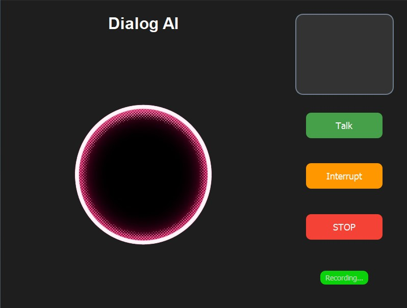
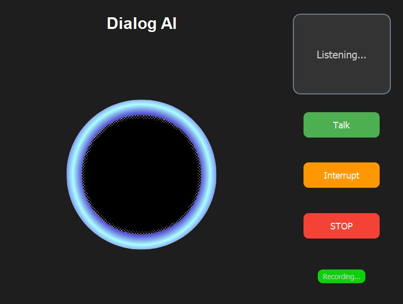

# <h1 align="center"> DialogAI </h1>
A Desktop App Designed for Voice Chat with an LLM

DialogAI is an advanced conversational AI system designed to provide real-time transcription, language model processing, and text-to-speech functionalities. This project leverages multiple APIs and libraries to deliver seamless and interactive voice-based interactions. The application is built with a graphical user interface (GUI).

# <h1 align="center"> Features </h1>

- Real-time Transcription: Captures and processes spoken language into text using Deepgram's transcription API.
- Language Model Processing: Utilizes state-of-the-art language models to generate responses based on the transcribed  text.
-Text-to-Speech (TTS): Converts the AI-generated text back into speech using Deepgram's TTS capabilities.
- Memory Management: Maintains a conversation history to provide contextually relevant responses.
- GUI: User-friendly interface for easy interaction with the system.

# <h1 align="center"> Screenshots </h1>
<p align="center">
  
  
</p>

# Installation

### Prerequisites

- Python 3.8 or higher
-langchain & langchain_groq
- API keys for Deepgram, Groq

### Clone the repository 

``` git clone https://github.com/Khaleelhabeeb/DialogAI.git  ```

### Install Dependencies

``` pip install -r requirements.txt ```

### Set Up Environment Variables

``` Create a .env file in the root directory and add your API keys ```

```python
GROQ_API_KEY=your_groq_api_key
DEEPGRAM_API_KEY=your_deepgram_api_key
```

### run the applicatio

``` python main.py ```

## Usage

- Start a Conversation: Speak into your microphone after starting the application. The system will transcribe your speech, generate a response, and speak back to you.

- End a Conversation: Say "goodbye" to terminate the session.


