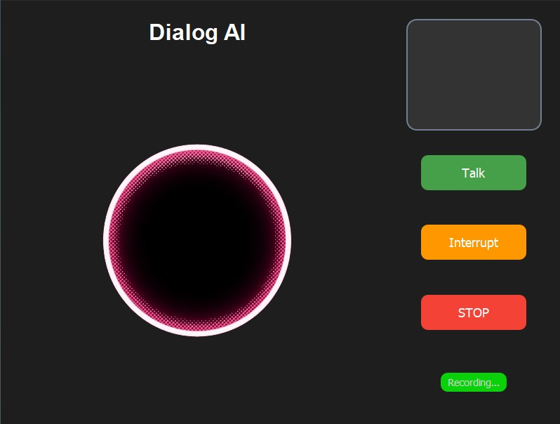
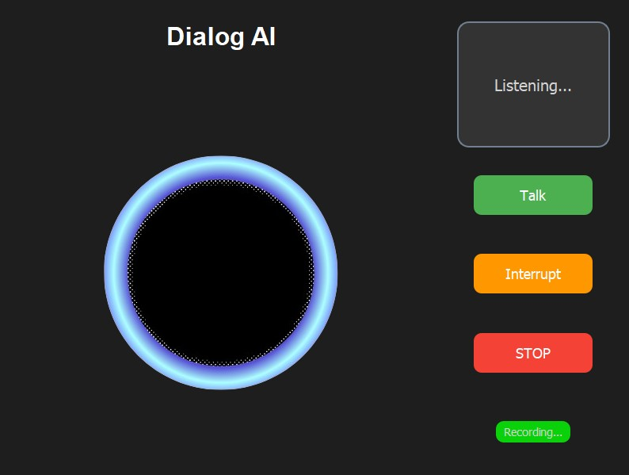

# <h1 align="center"> DialogAI </h1>
A Desktop App Designed for Voice Chat with an LLM, now powered by Electron for the UI.

DialogAI is an advanced conversational AI system designed to provide real-time transcription, language model processing, and text-to-speech functionalities. This project leverages APIs and libraries to deliver seamless and interactive voice-based interactions. The application is built with an Electron-based graphical user interface (GUI) and a Python backend.

# <h1 align="center"> Features </h1>

- Real-time Transcription: Captures and processes spoken language into text using Deepgram's transcription API.
- Language Model Processing: Utilizes state-of-the-art language models (via Groq) to generate responses based on the transcribed text.
- Text-to-Speech (TTS): Converts the AI-generated text back into speech using Deepgram's TTS capabilities.
- Memory Management: Maintains a conversation history to provide contextually relevant responses.
- GUI: User-friendly interface built with Electron for easy interaction with the system.

# <h1 align="center"> Screenshots </h1>
<p align="center">
  
  
  <!-- Add new screenshots of the Electron UI once available -->
</p>

# Installation

### Prerequisites

- Python 3.8 or higher
- Node.js and npm (for Electron UI)
- API keys for Deepgram and Groq

### 1. Clone the repository

```bash
git clone https://github.com/Khaleelhabeeb/DialogAI.git
cd DialogAI
```

### 2. Install Python Dependencies

It's recommended to use a virtual environment:
```bash
python -m venv venv
source venv/bin/activate  # On Windows use `venv\Scripts\activate`
```
Then install the Python packages:
```bash
pip install -r requirements.txt
```

### 3. Install Node.js Dependencies for Electron UI

Navigate to the project root (if not already there) and run:
```bash
npm install
```

### 4. Set Up Environment Variables

Create a `.env` file in the root directory of the project and add your API keys:
```env
GROQ_API_KEY="your_groq_api_key"
DEEPGRAM_API_KEY="your_deepgram_api_key"
```
Replace `"your_groq_api_key"` and `"your_deepgram_api_key"` with your actual API keys.

### 5. Run the Application

To start the Electron application, run the following command from the project root:
```bash
npm start
```
This will launch the Electron UI, which will in turn manage the Python backend processes.

## Usage

- **Start a Conversation**: Click the "Talk" button and speak into your microphone. The system will transcribe your speech, the AI will process it, and then speak its response.
- **Interrupt**: If the AI is speaking or you want to speak again while it's "thinking", you can click the "Interrupt" button. This will stop the current action and return to a listening state.
- **Stop Application**: Click the "STOP" button to close the application.
- **End a Conversation**: Saying "goodbye" during your turn will make the AI respond with a goodbye and end the current conversation session, readying itself for a new one.

## Project Structure Overview

- `src/`: Contains the Electron frontend code.
  - `main.js`: Main process for Electron, manages windows and IPC.
  - `index.html`: Main HTML file for the UI.
  - `renderer.js`: Handles logic for the `index.html` (renderer process).
  - `preload.js`: Securely exposes IPC channels to the renderer.
  - `styles.css`: CSS for the UI.
- `app/`: Contains the Python backend logic.
  - `conversation_manager.py`: Core class managing conversation flow, LLM interaction, and TTS.
  - `conversation_manager_electron.py`: Python script acting as an interface between Electron (`main.js`) and `conversation_manager.py`.
  - `llm.py`: Handles interaction with the Language Model (Groq).
  - `text_to_speech.py`: Handles Text-to-Speech functionality (Deepgram).
  - `transcript_collector.py`: Utility for collecting parts of a transcript.
- `utils/`: Utility scripts.
  - `audio_transcription.py`: Handles real-time audio transcription (Deepgram).
- `main.py`: Original entry point for the PyQt5 application (now superseded by `npm start` for the Electron version).
- `requirements.txt`: Python dependencies.
- `package.json`: Node.js dependencies and scripts for the Electron app.
- `.env`: Stores API keys (ensure this is in your `.gitignore` if it's not already).

## Development Notes

- **Electron & Python Communication**: The Electron frontend (Node.js) communicates with the Python backend using `python-shell`. Commands and data are exchanged via standard input/output, formatted as JSON.
- **Async Operations**: The Python backend uses `asyncio` to handle concurrent operations like listening for voice input, processing with the LLM, and generating speech, ensuring the application remains responsive.
- **UI Updates**: The Python backend sends status messages (e.g., "listening", "thinking", "speaking") and content (e.g., AI's thoughts) to the Electron frontend, which updates the UI elements accordingly.
